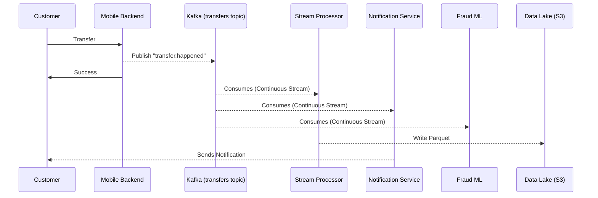

```mermaid
sequenceDiagram
    Customer                            ->>   Mobile Backend                  :         Transfer
    Mobile Backend                      -->>  Kafka (transfers topic)         :         Publish "transfer.happened" 
    Mobile Backend                      ->>   Customer                        :         Success
    Kafka (transfers topic)             -->>  Stream Processor                :         Consumes (Continuous Stream)
    Kafka (transfers topic)             -->>  Notification Service            :         Consumes (Continuous Stream)
    Kafka (transfers topic)             -->>  Fraud ML                        :         Consumes (Continuous Stream)
    Stream Processor                    -->>  Data Lake (S3)                  :         Write Parquet
    Notification Service                -->>  Customer                        :         Sends Notification
```