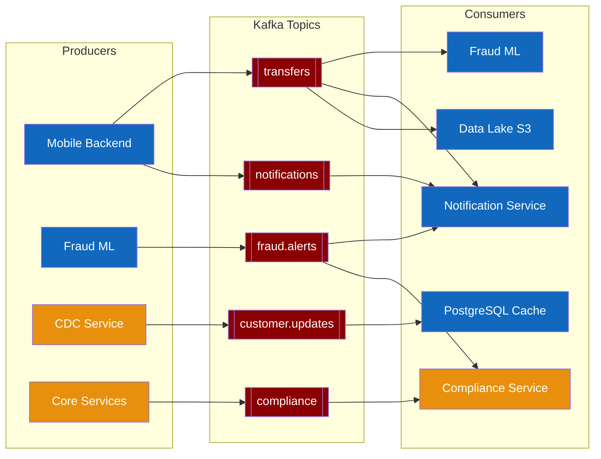

```mermaid
flowchart LR
    subgraph Producers
        MB[Mobile Backend]
        FML[Fraud ML]
        CDC[CDC Service]
        CS[Core Services]
    end

    subgraph Topics["Kafka Topics"]
        T1[[transfers]]
        T2[[customer.updates]]
        T3[[fraud.alerts]]
        T4[[notifications]]
        T5[[compliance]]
    end

    subgraph Consumers
        FML2[Fraud ML]
        NS[Notification Service]
        DL[Data Lake S3]
        PG[PostgreSQL Cache]
        CP[Compliance Service]
    end

    MB --> T1
    MB --> T4
    FML --> T3
    CDC --> T2
    CS --> T5

    T1 --> FML2
    T1 --> NS
    T1 --> DL
    T2 --> PG
    T3 --> NS
    T3 --> CP
    T4 --> NS
    T5 --> CP

    style MB fill:#1168bd,color:#fff
    style FML fill:#1168bd,color:#fff
    style CDC fill:#e8900e,color:#fff
    style CS fill:#e8900e,color:#fff

    style T1 fill:#8B0000,color:#fff
    style T2 fill:#8B0000,color:#fff
    style T3 fill:#8B0000,color:#fff
    style T4 fill:#8B0000,color:#fff
    style T5 fill:#8B0000,color:#fff

    style FML2 fill:#1168bd,color:#fff
    style NS fill:#1168bd,color:#fff
    style DL fill:#1168bd,color:#fff
    style PG fill:#1168bd,color:#fff
    style CP fill:#e8900e,color:#fff
```