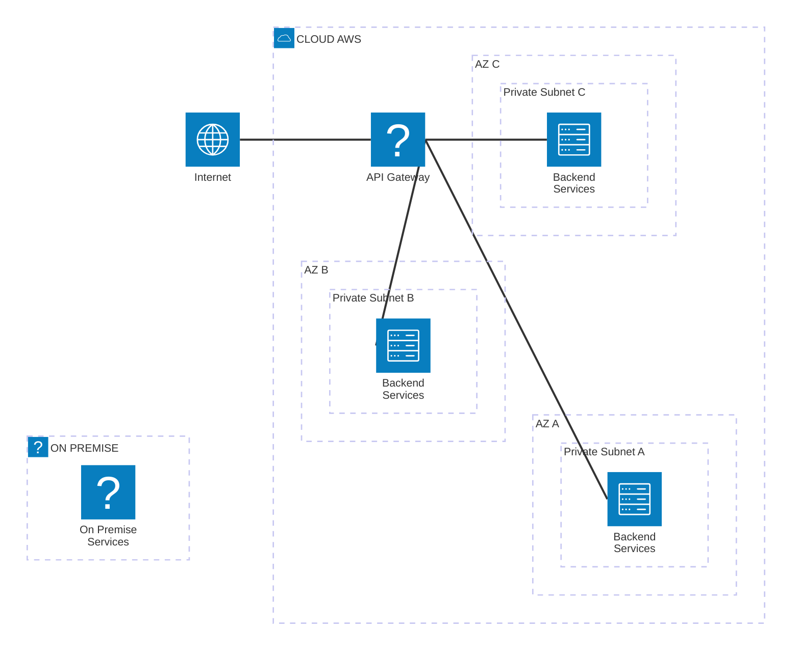

```mermaid
architecture-beta

    service internet(internet)[Internet]

    group prem(premise)[ON PREMISE]

    group cloud(cloud)[CLOUD AWS]

        service api_gateway(api)[API Gateway] in cloud

        group az_a[AZ A] in cloud

        group az_b[AZ B] in cloud

        group az_c[AZ C] in cloud

        group private_subnet_a[Private Subnet A] in az_a
        group private_subnet_b[Private Subnet B] in az_b
        group private_subnet_c[Private Subnet C] in az_c


    service backend_services(server)[Backend Services] in private_subnet_a
    service backend_services_b(server)[Backend Services] in private_subnet_b
    service backend_services_c(server)[Backend Services] in private_subnet_c

    service prem_services(prem_services)[On Premise Services] in prem

    internet:R -- L:api_gateway

    api_gateway:R -- L:backend_services
    api_gateway:R -- L:backend_services_b
    api_gateway:R -- L:backend_services_c
```
